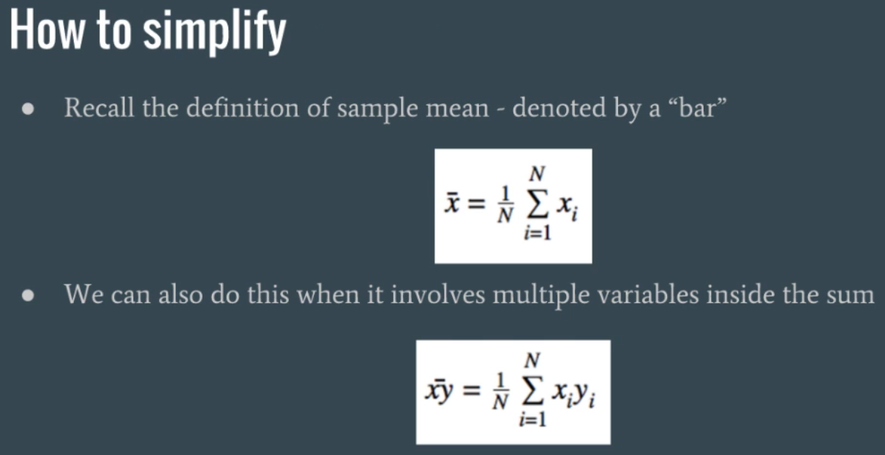

## 1-D Linear Regression
## Simple Linear Regression

### Simple example
- Ohm's Law: **V= IR**
- V = voltage
- I = current
- R = resistance
- This is the equation for a line!
- y = mx + b
  - Where:
    - y = V
    - x = I
    - m = R
    - b = 0

### All data is the same
- This doesn't just apply to Ohm's Law
- Y-axis and X-axis can represent anything
- Blood pressure vs age
- Blood pressure vs weight
- Stock price vs. Twitter sentiment score
- The methods stay the same, no matter what we are measuring
- No difference between "Linear regression for biologists" and "linear regression for financial engineers"
- **<u>All data is the same</u>**

-----
- So let's re-state our problem in more general terms
- We are given a set of points: **{(x1,y1), (x2,y2),...,(xn,yn)}**
- We plot them in a **2-D** chart
- We find the line of best fit
- Is there a more systematic way of doing it, other than drawing it using paper and a ruler? Of course
----


------


-----


-------
- What is the *t* that give minimum **E**


-------
- Since **y-hat** is **ax + b** --> we can subsitube
- Two unknowns variables: **a** and **b**


---------


-------


-----


------


------


------


------


------


------


-----


-----



------


-------
- **Numpy trick**


-------

```csv
/* data_1d.csv */
95.724162408,197.179636092
35.7576189281,67.5906695414
28.8168474238,60.8541328206
99.9584813087,196.907396981
66.8097483121,125.311128524
...
```


```py
import numpy as np
import matplotlib.pyplot as plt

# Load the data
X = []
Y = []
for line in open('data_1d.csv'):
  x, y = line.split(',')
  X.append(float(x))
  Y.append(float(y))

# turn X and Y into numpy arrays
X = np.array(X)
Y = np.array(Y)

# plot to see what it look like
plt.scatter(X,Y)
plt.show()

# apply the equations we learned to calculate a and b
denominator = X.dot(X) - X.mean() * X.sum()
a = (X.dot(Y) - Y.mean()*X.sum()) / denominator
b = (Y.mean() * X.dot(X) - X.mean() * X.dot(Y)) / denominator

# Calculated predicted Y
Yhat = a*X + b

# Plot it all
plt.scatter(X, Y)
plt.plot(X, Yhat)
plt.show()

# Calculate R-Squared
d1 = Y - Yhat
d2 = Y - Y.mean()
r2 = 1 - d1.dot(d1) / d2.dot(d2)
print "The R-Squared is ", r2
# The R-Squared is  0.991183820298
```

- **Original data**


- **Linear Regression Predicting**


--------

### Moore

```py
import re
import numpy as np
import matplotlib.pyplot as plt

X = []
Y = []

non_decimal = re.compile(r'[^\d]+')

for line in open('moore.csv'):
  r = line .split('\t')

  x = int(non_decimal.sub('',r[2].split('[')[0])) # year
  y = int(non_decimal.sub('',r[1].split('[')[0])) # trasition count
  X.append(x)
  Y.append(y)

X = np.array(X)
Y = np.array(Y)

# without scalling
plt.scatter(X,Y)
plt.title('RAW DATA')
plt.show()

# after scalling
Y = np.log(Y)
plt.scatter(X,Y)
plt.title('After log(DATA)')
plt.show()

denominator = X.dot(X) - X.mean() * X.sum()
a = ( X.dot(Y) - Y.mean() * X.sum() ) / denominator
b = ( Y.mean() * X.dot(X) - X.mean() * X.dot(Y) ) / denominator

Yhat = a*X + b

plt.scatter(X, Y)
plt.plot(X, Yhat)
plt.title('Predicted, close to line')
plt.show()

d1 = Y - Yhat # how far we off from the actual value
d2 = Y - Y.mean() # how far we off if we just predicted the mean
r2 = 1 - d1.dot(d1) / d2.dot(d2)
print ("a: ", a, "b: ", b)
print ("The R-Squared is: ", r2)

# tc = trasition time
# log(tc) = a*year + b
# tc = exp(b) * exp(a * year)
# 2*tc = 2 * exp(b) * exp(a * year) = exp(ln(2)) * exp(b) * exp(a * year)
# = exp(b) * exp(a * year + ln(2))

# --> exp(b) * exp(a*year2) = exp(b) * exp(a*year1 + ln2)
# a*year2 = a*year1 + ln2
# year2 = year1 + ln2/a
print("time to double: ", np.log(2)/a, " years")
"""
('a: ', 0.35104357336499337, 'b: ', -685.00028438165475)
('The R-Squared is: ', 0.95294428522857566)
('time to double: ', 1.974533172379868, ' years')
"""
```


