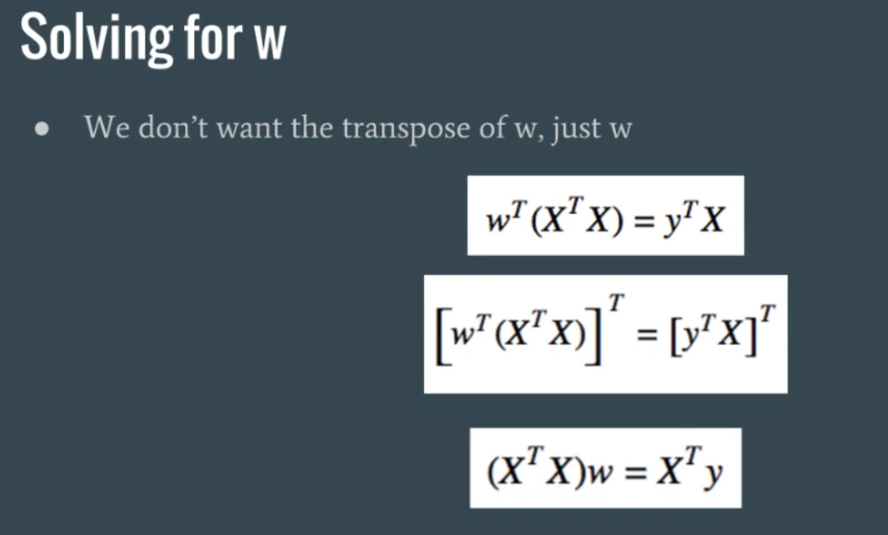

## Multiple Linear Regression

- What if there are multiple inputs that affect your output?
- Is the most realistic scenario: multiple factors affect the outcome
- Ex. blood pressure predicted by age and weight, better than age alone or weight alone
- Ex. housing price predicted by neighborhood and size of the house itself
- Sometimes all the inputs are important, we want to include all of them to improve accuracy


------


------


------


------


------


------


------


------


------


------


------


------


------


------



------


------


-------


-------


-------


------

```txt
data_2d.csv
17.9302012052,94.5205919533,320.259529602
97.1446971852,69.5932819844,404.634471526
81.7759007845,5.73764809688,181.485107741
55.8543424175,70.3259016768,321.773638018
49.3665499855,75.1140401571,322.465485583
...
```

```py
import numpy as np
from mpl_toolkits.mplot3d import Axes3D
import matplotlib.pyplot as plt

# load the data
X = []
Y = []
for line in open('data_2d.csv'):
  x1, x2, y = line.split(',')
  X.append([float(x1), float(x2), 1])
  Y.append(float(y))

# turn X and Y into numpy arrays
X = np.array(X)
Y = np.array(Y)

# let's plot the data to see what the data looks like
fig = plt.figure()
ax = fig.add_subplot(111, projection='3d')
ax.scatter(X[:,0], X[:,1], Y)
plt.show()


# calculate weights  X.T = tranpose of X
w = np.linalg.solve(np.dot(X.T, X), np.dot(X.T, Y))
Yhat = np.dot(X,w) # Xw

# Calculate R-Squared
d1 = Y - Yhat
d2 = Y - Y.mean()
r2 = 1 - d1.dot(d1) / d2.dot(d2)
print "The R-Squared is ", r2
#The R-Squared is  0.998004061248
```


-------

## Linear Regression Poly

```txt
data_poly.csv
76.7007086033,663.797275569
95.2735441552,1014.3622816
73.0957232493,618.938826916
46.9516354572,288.012877367
...
```

```py
import numpy as np
import matplotlib.pyplot as plt

# load the data
X = []
Y = []

for line in open('data_poly.csv'):
  x, y = line.split(',')
  x = float(x)
  X.append([1, x, x*x])
  Y.append(float(y))

# convert to numpy arrays
X = np.array(X)
Y = np.array(Y)

# Let's plot to see what it looks like
plt.scatter(X[:,1], Y)
plt.title("Raw data")
plt.show()


# Calculate weights
w = np.linalg.solve(np.dot(X.T, X), np.dot(X.T, Y))
Yhat = np.dot(X, w)

# plot it all together
plt.scatter(X[:,1], Y)
plt.plot(sorted(X[:,1]), sorted(Yhat))
plt.title("Predicted line")
plt.show()


# Calculate R-Squared
d1 = Y - Yhat
d2 = Y - Y.mean()
r2 = 1 - d1.dot(d1) / d2.dot(d2)
print "The R-Squared is ", r2
#The R-Squared is  0.999141229637
```


