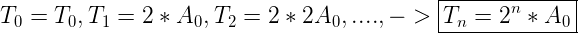
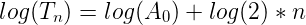

## Machine Learning (ML)
- Try to predict an ouotcome from past examples
  - Predict tomorrow's weather
  - Stack market
  - Disease

### 2 Board Categories in ML
- **Supervised**:
  - Output is given (X -> Y)
  - Any X can prediect a Y
- **Unsupervised:**
  - No output, just trying to learn structure (X)

#### 2 type of supervised learning
- **Classification**
  - Trying to predict a category or label
    - What digit is this?
    - Does this picture contain a cat?
- **Regression**
  - Predicting a real-valued number or vector
  - temperature
  - GOOG stock price
------

## Linear Regression
- Also know as "line of best fit"
- Supervised X -> Y
- Regression
  - Output(Y) is a number

#### Real world examples
- X = #hours of exercise in a week -> Y = body mass index
- X = #hours of studying -> Y = grade

------
## Moore's Law
- Great thing about linear regression: it's applicable to many problems, even ones that don't seem linear at first
- First line of attach to discover correlations in data
- We'll use it for Moore's Law:
  - Transistor count on integrated circuits doubles every 2 years

- Yes!

- Time (in years) on the x-axis, log of transistor counts on the y-axis
